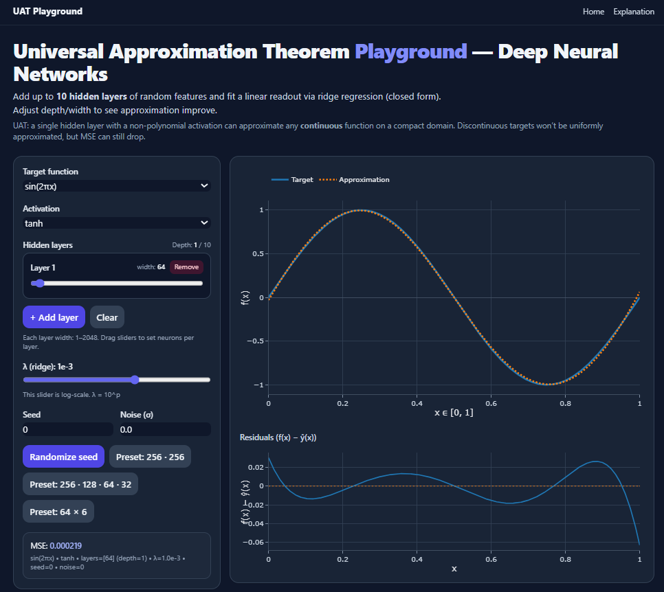

# 🌌 Universal Approximation Theorem Playground (Flask + Plotly)

An interactive web app to **visualize the Universal Approximation Theorem (UAT)**  
and experiment with **deep neural networks** using **random features** + **closed-form ridge regression**.  

Built with **Flask**, **NumPy**, **Tailwind CSS**, and **Plotly**.



---

## ✨ Features

- **Target functions**: sine, cubic, absolute value, Gaussian bump, square wave
- **Activations**: tanh, ReLU, sigmoid
- **Configurable hidden layers**: from **1 up to 10** (sliders for widths)
- **Closed-form solution**: fast ridge regression readout instead of iterative training
- **Residuals plot**: shows where approximation succeeds/fails
- **Dark theme**: modern UI with Tailwind
- **Explanation page**: `/about` with theory, math, and guidance

---

## 📖 Background

The **Universal Approximation Theorem** says:

> A feed-forward neural network with a single hidden layer and a suitable activation function  
> can approximate any continuous function on a compact interval to arbitrary precision.

This app illustrates that principle in practice:

- Hidden layers are **randomly initialized** (not trained).
- Features are passed forward → producing nonlinear basis functions φ(x).
- A **linear readout** is trained in closed form:

\[
w = (\Phi^\top \Phi + \lambda I)^{-1} \Phi^\top y
\]

This is the **Extreme Learning Machine / Random Kitchen Sinks** approach.  
You can see how increasing depth and width reduces approximation error.

---

## 🚀 Getting Started

### 1. Clone the repo

```bash
git clone https://github.com/yourname/uat-playground.git
cd uat-playground
```

### 2. Install dependencies

Create a virtualenv (recommended):

```bash
python -m venv .venv
source .venv/bin/activate  # on Linux/Mac
.venv\Scripts\activate     # on Windows
```

Install requirements:

```bash
pip install flask numpy
```

### 3. Run the app

```bash
python app.py
```

Then open:  
👉 http://127.0.0.1:5000/

---

## 📂 Project Structure

```
uat-playground/
│
├── app.py                # Flask backend (routes + approximation logic)
├── templates/
│   ├── index.html         # main UI
│   └── about.html         # explanation page
├── static/
│   └── uat.js             # frontend logic (Plotly + interactivity)
├── docs/
│   └── screenshot-dark.png (optional demo image)
└── README.md
```

---

## 🎮 Usage Tips

- Try **1 hidden layer with many neurons** vs **multiple layers with fewer neurons**.
- Compare **tanh, ReLU, sigmoid** activations.
- Use the **square wave** target to see why UAT is about *continuous* functions.
- Add **noise** to training data and adjust λ (ridge regularization).
- Watch the **residuals plot** to see where the approximation struggles.

---

## 📜 License

MIT License © 2025 [Shashank Sane]  

---

## 🙏 Acknowledgments

- **Universal Approximation Theorem**: Cybenko (1989), Hornik (1991)
- **Random Features / ELM**: Rahimi & Recht (2008), Huang et al. (2006)
- Styling inspired by **Tailwind CSS** and plotting with **Plotly.js**
